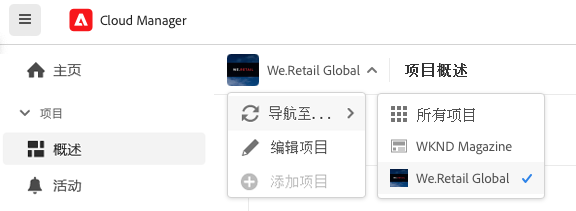
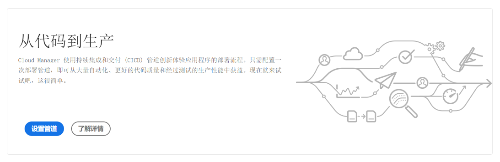

# 导航Cloud Manager UI {#navigation}

了解 Cloud Manager UI 的组织方式，以及如何管理您的程序和环境。

Cloud Manager UI 主要由两个图形界面组成：

* 在[我的程序控制台](#my-programs-console)中，您可以查看和管理您的所有程序。
* 在[程序概述窗口](#program-overview)中，您可以查看单个程序的详细信息，并对其进行管理。

## 我的程序控制台 {#my-programs-console}

当您在[experience.adobe.com](https://experience.adobe.com/experiencemanager)登录Cloud Manager并选择适当的组织时，即进入&#x200B;**我的程序**&#x200B;控制台。

**我的程序**&#x200B;控制台提供了在选定组织中您有权访问的所有程序的概述。 它由几个部分组成。

|   | 区域 | 描述 |
| --- | --- | --- |
| 1 | [工具栏](#toolbars-my-programs-toolbars) | 用于组织选择、警报和帐户设置。 |
| 2 | 左侧面板选项卡 | 允许您切换程序当前视图的各种选项卡，包括： <ul><li>**Experience Manager**&#x200B;打开各种AEM解决方案的主页</li><li>**所有程序**&#x200B;显示所有可用程序。</li><li>**许可证**&#x200B;打开许可证仪表板。 许可证仪表板仅适用于&#x200B;*AEM as a Cloud Service程序* (AEMaaCS)，而不适用于Adobe Managed Services程序，如AEM 6.5和AEM 6.5 LTS。 要确定您的程序具有的服务类型（AEMaaCS或AMS），请参阅本文的[程序卡部分](#program-cards)。 这些选项卡默认为已关闭，可以使用位于左侧的[显示菜单图标](#cloud-manager-header)下拉菜单显示。</li></ol> |
| 3 | [我的程序](#my-programs-section) | 列出可以选择的所有可用程序。 有关程序的详细信息，请参阅[程序和程序类型](/help/getting-started/program-setup.md)。 |
| 4 | [行动号召和统计数据](#cta-statistics) | 提供近期活动的概览。 |
| 5 | [快速链接](#quick-links) | 快速访问相关资源。 |

### 工具栏 {#my-programs-toolbars}

有两个工具栏彼此叠放在一起。

#### Cloud Manager 标头 {#cloud-manager-header}

第一个是 Cloud Manager 标头。 当您浏览 Cloud Manager 时，该标头会持久显示。作为一个锚点，它有助于您访问适用于各个 Cloud Manager 程序的设置和信息。

| 区域 | 描述 |
| --- | --- |
|  | 一个下拉菜单，提供对各个项目特定部分的选项卡的访问。 要确定您的程序具有的服务类型（AMS或AEMaaCS），请参阅本文档的[程序卡部分](#program-cards)。 |
|  Cloud Manager | 单击以打开Cloud Manager的&#x200B;**我的程序**&#x200B;控制台，无论您在Cloud Manager中的哪个位置。 |
| *`Name of selected organization`* | 组织选择器显示您当前登录的组织（在此示例中为&#x200B;*Foundation Internal*）。 如果您的Adobe ID与多个组织相关联，请单击以切换到另一个组织。 |
| 反馈 | 单击以向Adobe提供有关Cloud Manager的反馈。 |
|  | AI Assistant提供了一个对话界面，旨在简化对AEM相关查询的查找。 查看[AI助手](https://experienceleague.adobe.com/en/docs/experience-manager-65/content/ai-in-aem/ai-assistant/ai-assistant-in-aem#) |
|  | 单击以提供对学习和支持资源的快速访问。 |
|  | 单击以查看当前分配的未完成[通知的数量](/help/using/notifications.md) |
|  | 单击可在AEM主页和AEM解决方案之间快速移动 |
| *`Dynamic Account icon`* | 单击您的用户图片以访问您的&#x200B;**帐户设置**&#x200B;和&#x200B;**程序设置**，或者注销。 如果您选择不添加用户图片，则会随机分配图标（如上面的工具栏图像所示）。 |

<!--
1. The  icon on the left side of the header is  
   * The License Dashboard only applies to AEM as a Cloud Service programs, not AMS programs.
   * To determine the type of service your program has (AMS or AEMaaCS), see the [Program Cards section](#program-cards) of this document.
1. The **Adobe Cloud Manager** button takes you back to the **My Programs** console of Cloud Manager no matter where you are in Cloud Manager.
1. Click **Feedback** to provide feedback to Adobe about Cloud Manager.
1. The organization selector displays the organization that you are currently signed into (in this example, Foundation Internal). Click to switch to another organization if your Adobe ID is associated with multiple.
1. Clicking the solutions switcher lets you quickly jump to other Experience Cloud solutions.
1. The Help icon provides quick access to learning and support resources.
1. The notifications icon is badged with the number of currently assigned incomplete [notifications](/help/using/notifications.md)
1. Select the icon representing your user to access your user settings. If you do not select a user picture, an icon is randomly assigned. -->

#### 程序工具栏 {#program-toolbar}

程序工具栏可以提供在 Cloud Manager 程序和适合上下文的操作之间切换的链接。

|   | 区域 | 描述 |
| --- | --- | --- |
| 1 | 我的程序 | 单击以打开一个下拉列表，您可以从中选择添加程序、选择其他现有程序或返回到Experience Manager主页。 |
| 2 | 快速入门 | 单击以访问[入门文档历程](https://experienceleague.adobe.com/zh-hans/docs/experience-manager-cloud-service/content/onboarding/journey/overview)，让您启动并运行Cloud Manager。 入门培训历程是为Adobe Experience Manager as a Cloud Service (AEMaaCS)上的Cloud Manager设计的，而不是Adobe Managed Services (AMS)上的Cloud Manager设计的。 但很多概念是相同的。 |
| 3 | *`Dynamic action button`* | 操作按钮提供了与上下文相关的操作，您可以单击这些操作，例如&#x200B;**添加项目**（如上面的示例中所示）或添加域。 |

### 操作号召和统计数据 {#cta-statistics}

操作号召和统计信息数据部分提供了您组织的汇总数据，例如，如果您已成功设置了程序，则可能会显示过去 90 天的活动统计数据，其中包括：

* [部署](/help/using/code-deployment.md)次数
* 已发现的[代码质量问题](/help/using/code-quality-testing.md)数量
* 版本数

或者，如果您刚刚开始建立您的组织，则可能会有关于后续步骤或文档资源的提示。

### 我的程序 {#my-programs-section}

“我的程序”控制台的主要内容是&#x200B;**我的程序**&#x200B;部分，其中会将您的程序列为单独的信息卡。 单击一张信息卡即可访问该程序的&#x200B;**程序概述**&#x200B;页面，了解有关该程序的详细信息。

根据您的权限，您可能无法选择某些程序。

您可以使用以下排序选项快速查找所需的程序：

* 排序方式：
   * 创建日期
   * 项目名称
   * 状态
*  / 按顺序排列程序或按顺序排列。
*  / 分别以网格表单或列表表单查看程序。

#### 程序信息卡 {#program-cards}

每个程序都会由一张信息卡或表格中的一行来表示，其中提供有关该程序的概述以及采取操作的快速链接。

* 程序图像（如果进行了配置）
* 项目名称（在上例中，*WKND Magazine*）
* 服务类型：
   * **Experience Manager** 适用于 AMS 计划
   * **Experience Manager Cloud** 适用于 [AEM as a Cloud Service 计划](https://experienceleague.adobe.com/zh-hans/docs/experience-manager-cloud-service/content/implementing/home)
* 状态（在上例中，*就绪*）
* 已配置的解决方案
* 创建日期

单击可快速访问有关程序的其他信息（在列表视图中很有用）。

Cloud Manager AMS中的

单击可让您对程序执行其他操作。

* Experience Manager主页
* 导航至程序的特定[环境](/help/using/managing-environments.md) 
* 打开[程序概述](#program-overview)
* [编辑程序](/help/getting-started/program-setup.md)
* 显示监控

### 快速链接 {#quick-links}

通过快速链接部分可以访问有用的相关资源。

## 程序概述窗口 {#program-overview}

当您在&#x200B;[**我的程序**&#x200B;控制台](#my-programs-console)中选择一个程序后，您就会进入&#x200B;**程序概述**&#x200B;页面。

**计划概述**&#x200B;允许您访问Cloud Manager计划的所有详细信息。 与&#x200B;**我的项目群**&#x200B;一样，它由若干部分组成。

1. 通过[工具栏](#program-overview-toolbar)可以快速跳转回&#x200B;**我的程序**&#x200B;控制台并导航该程序。
1. [选项卡区域](#program-tabs)可在程序的不同方面之间切换。
1. 根据对程序的最后操作制定的[行动号召](#cta)。
1. 已关联程序的[环境](#environments)。
1. 已关联项目的[管道](#pipelines)。

### 工具栏 {#program-overview-toolbar}

程序概述的工具栏与[我的程序控制台](#my-programs-toolbars)的工具栏相似。 这里仅说明差异。

#### Cloud Manager 标头 {#cloud-manager-header-2}

Cloud Manager标题有一个下拉菜单，该菜单会自动打开以显示程序概述的可导航选项卡。

单击以隐藏选项卡。

#### 程序工具栏 {#program-toolbar-2}

程序的工具栏仍然允许您快速切换到其他程序，但它还可以执行适合上下文的操作，例如添加和编辑程序。

此外，如果您使用）隐藏选项卡，则工具栏仍会显示您当前所在的选项卡。

### 程序选项卡 {#program-tabs}

每个程序都有许多与之相关的选项和数据。 这些数据被收集到选项卡中，以简化程序导航。通过这些选项卡您可以访问：

* 概述：当前文档中描述的程序概述
* [活动](/help/using/managing-pipelines.md#activity)：程序的管道运行历史
* [管道](/help/using/managing-pipelines.md#pipelines)：为程序配置的所有管道
* [存储库](/help/managing-code/managing-repositories.md)：为程序配置的所有存储库
* [报告](/help/using/monitoring-environments.md#system-monitoring-overview)：SLA 数据等量度
* [环境](/help/using/managing-environments.md)：为程序配置的所有环境
* [内容集](/help/using/content-copy.md)：为复制目的而创建的内容集
* [复制内容活动](/help/using/content-copy.md)：内容复制活动
* 学习路径：有关 Cloud Manager 的其他学习资源

默认情况下，当您打开一个程序时，您会进入&#x200B;**概述**&#x200B;选项卡。当前选项卡会突出显示。选择另一个选项卡来显示其详细信息。

在中使用[显示菜单图标](#cloud-manager-header-2)汉堡来隐藏选项卡。

### 行动号召 {#cta}

行动号召部分会根据您的程序状态为您提供有用的信息。 对于新程序，您可能会看到所提供的后续步骤和上线日期提醒（[在程序创建期间设置](/help/getting-started/program-setup.md)）。

对于实时程序，上次部署的状态包含详细信息链接以及开始新部署的链接。

### 环境信息卡 {#environments}

**环境**&#x200B;信息卡可以为您提供环境概述和快速操作的链接。

**环境**&#x200B;信息卡仅列出三个新环境。 单击&#x200B;**全部显示**&#x200B;按钮，查看程序的所有环境。

请参阅[管理环境](/help/using/managing-environments.md)，了解有关如何管理环境的详细信息。

### 管道信息卡 {#pipelines}

**管道**&#x200B;信息卡可以为您提供管道概述和快速操作的链接。

**管道**&#x200B;信息卡仅会列出三条管道。单击&#x200B;**全部显示**&#x200B;按钮，查看程序的所有管道。

请参阅[管理管道](/help/using/managing-pipelines.md)，了解有关如何管理管道的详细信息。

### 实用资源 {#useful-resources}

**实用资源**&#x200B;部分提供了有关 Cloud Manager 的其他学习资源的链接。
