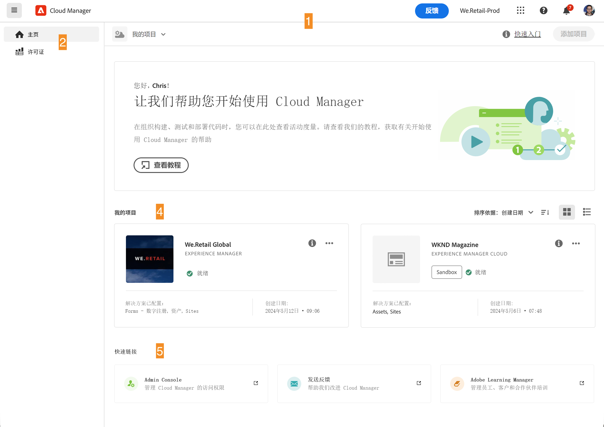
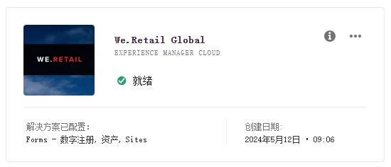
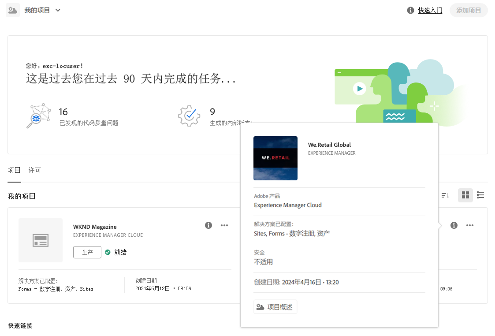
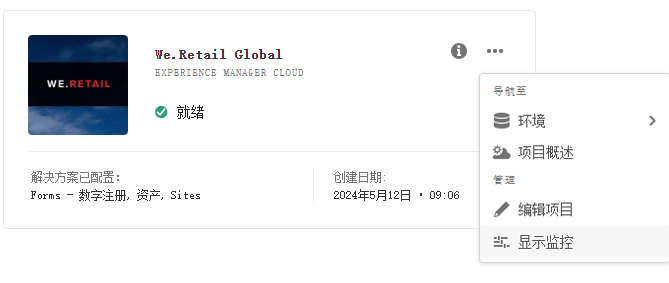
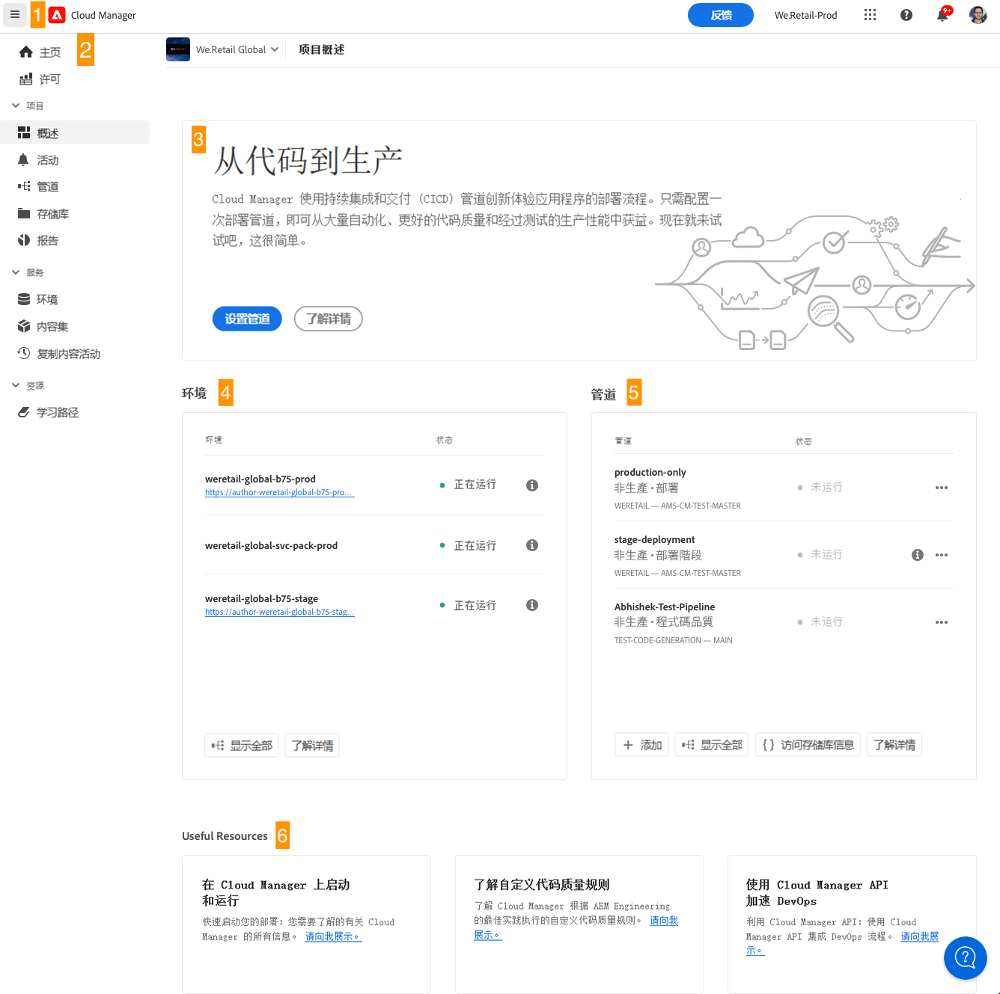

# 导航 Cloud Manger UI {#navigation}

了解 Cloud Manager UI 的组织方式，以及如何管理您的程序和环境。

Cloud manage UI 主要由两个图形界面组成：

* 在[我的程序控制台](#my-programs-console)中，您可以查看和管理您的所有程序。
* 在[程序概述窗口](#program-overview)中，您可以查看单个程序的详细信息，并对其进行管理。

## 我的程序控制台 {#my-programs-console}

当您登录 [my.cloudmanager.adobe.com](https://my.cloudmanager.adobe.com/) 上的 Cloud Manager 并选择适当的组织时，您将会进入&#x200B;**我的程序**&#x200B;控制台。

“我的程序”控制台提供了对您在所选组织中有权访问的所有程序的概述。它由几个部分组成。

1. 用于组织选择、警报和帐户设置的[工具栏](#toolbars-my-programs-toolbars)
1. 选项卡允许您切换程序的当前视图。
   * **主页** 视图（默认），选择 **我的程序** 视图，其中显示所有项目的概览
   * **访问许可证仪表板的许可证**。许可证仪表板仅适用于 AEM as a Cloud Service 计划，而不适用于 AMS 计划。
      * 要确定您的程序具有的服务类型（AMS或AEMaaCS），请参阅本文档的[程序卡部分](#program-cards)。
   * 请注意，这些选项卡默认为已关闭，可以使用[Cloud Manager标题](#cloud-manager-header)中的汉堡菜单显示。
1. [操作号召和统计数据](#cta-statistics)，用于概述您最近的活动
1. [**我的程序** 部分](#my-programs-section) ，其中概述了您的所有计划
1. [快速链接](#quick-links)可用于轻松访问相关资源

>[!TIP]
>
>有关程序的详细信息，请参阅[程序和程序类型](/help/getting-started/program-setup.md)。

### 工具栏 {#my-programs-toolbars}

有两个工具栏彼此叠放在一起。

#### Cloud Manager 标头 {#cloud-manager-header}

第一个是 Cloud Manager 标头，它会在您浏览 Cloud Manager 时持久显示。作为一个锚点，它有助于您访问适用于各个 Cloud Manager 程序的设置和信息。

1. 汉堡菜单可以访问选项卡，可以将您带到单个程序的特定部分，或者根据上下文在许可证仪表板和 **[我的程序](#my-programs-console)** 控制台之间切换。
   * 许可证仪表板仅适用于 AEM as a Cloud Service 计划，而不适用于 AMS 计划。
   * 要确定您的程序具有的服务类型（AMS或AEMaaCS），请参阅本文档的[程序卡部分](#program-cards)。
1. 无论您在浏览 Cloud Manager 的哪个分区，Cloud Manager 按钮都会带您返回到 Cloud Manager 中的“我的程序”控制台。
1. 单击“反馈”按钮，向Adobe提供有关Cloud Manager的反馈。
1. 组织选择器会显示您当前登录的组织（在此示例中为 Foundation Internal）。如果您的Adobe ID与多个组织相关联，请单击以切换到其他组织。
1. 通过单击解决方案切换器，可快速跳转到其他Experience Cloud解决方案。
1. 可使用帮助图标快速访问学习和支持资源。
1. 通知图标带有标记，显示当前分配的未完成[通知的数量](/help/using/notifications.md)
1. 选择代表用户的图标来访问用户设置。如果您尚未配置用户图片，系统会随机分配一个图标。

#### 程序工具栏 {#program-toolbar}

程序工具栏可以提供在 Cloud Manager 程序和适合上下文的操作之间切换的链接。

1. 程序选择器会打开一个下拉菜单，您可以在其中快速选择其他程序或采取适合上下文的操作，例如创建一个新程序
1. 通过“快速入门”链接，您可以访问[入门文档历程](https://experienceleague.adobe.com/zh-hans/docs/experience-manager-cloud-service/content/onboarding/journey/overview)，以便快速开始使用 Cloud Manager。
   * 请注意，入门历程是为 AEM as a Cloud Service 而非 AMS 云服务设计的，但许多概念是相同的。
1. 操作按钮可以提供适合上下文的操作，例如创建新程序。

### 操作号召和统计数据 {#cta-statistics}

操作号召和统计信息数据部分提供了您组织的汇总数据，例如，如果您已成功设置了程序，则可能会显示过去 90 天的活动统计数据，其中包括：

* [部署](/help/using/code-deployment.md)次数
* 已发现的[代码质量问题](/help/using/code-quality-testing.md)数量
* 版本数

或者，如果您刚刚开始建立您的组织，则可能会有关于后续步骤或文档资源的提示。

### 我的程序部分 {#my-programs-section}

“我的程序”控制台的主要内容是&#x200B;**我的程序**&#x200B;部分，其中将您的程序列为单独的卡片。单击卡以访问程序的&#x200B;**程序概述**&#x200B;页面，了解有关程序的详细信息。

>[!NOTE]
>
>根据您的权限，您可能无法选择某些程序。

使用排序选项可以更好地找到您需要的程序。

* 排序依据
   * 创建日期（默认）
   * 项目名称
   * 状态
* 升序（默认）/降序
* 网格视图（默认）
* 列表视图

#### 程序信息卡 {#program-cards}

每个程序都会由一张信息卡（或表格中的一行）来表示，其中提供该程序的概述以及采取操作的快速链接。

* 程序图像（如果进行了配置）
* 项目名称
* 服务类型：
   * **Experience Manager** 适用于 AMS 计划
   * **Experience Manager Cloud** 适用于 [AEM as a Cloud Service 计划](https://experienceleague.adobe.com/zh-hans/docs/experience-manager-cloud-service/content/implementing/home)
* 状态
* 已配置的解决方案
* 创建日期

通过信息图标还可以快速访问有关该程序的附加信息（在列表视图中很有用）。

通过省略号图标可以访问可在该程序上执行的其他操作。

* 导航至程序的特定[环境](/help/using/managing-environments.md) 
* 打开[程序概述](#program-overview)
* [编辑程序](/help/getting-started/program-setup.md)
* 显示监控

### 快速链接 {#quick-links}

通过快速链接部分可以访问常用的相关资源。

## 程序概述窗口 {#program-overview}

在&#x200B;[**我的程序**&#x200B;控制台](#my-programs-console)中选择程序后，将转到程序概述。

通过程序概述，您可以访问 Cloud Manager 程序的所有详细信息。与“我的程序”控制台一样，它由几个部分组成。

1. [工具栏](#program-overview-toolbar)快速跳回“我的程序”控制台并导航该程序
1. [选项卡](#program-tabs)用于在程序的不同方面之间进行切换
1. 根据对程序的最后操作制定的[行动号召](#cta)
1. 对程序[环境的概述](#environments)
1. 对程序[管道的概述](#pipelines)
1.  [有用资源](#useful-resources)的链接

### 工具栏 {#program-overview-toolbar}

程序概述的工具栏与[我的程序控制台](#my-programs-toolbars)的工具栏非常相似。 此处仅说明了二者的差异。

#### Cloud Manager 标头 {#cloud-manager-header-2}

Cloud Manager 标头有一个汉堡菜单，该菜单可自动打开以显示程序概述中的可导航选项卡。

单击汉堡菜单图标以隐藏选项卡。

#### 程序工具栏 {#program-toolbar-2}

程序的工具栏仍然允许您快速切换到其他程序，但它还可以执行适合上下文的操作，例如添加和编辑程序。

此外，如果您选择使用汉堡菜单隐藏选项卡，则工具栏始终会提供您所在的选项卡。

### 程序选项卡 {#program-tabs}

每个程序都有许多与之相关的选项和数据。这些数据被收集到选项卡中，以简化程序导航。通过这些选项卡您可以访问：

* 概述：当前文档中描述的程序概述
* [活动](/help/using/managing-pipelines.md#activity)：程序的管道运行历史
* [管道](/help/using/managing-pipelines.md#pipelines)：为程序配置的所有管道
* [存储库](/help/managing-code/managing-repositories.md)：为程序配置的所有存储库
* [报告](/help/using/monitoring-environments.md#system-monitoring-overview)：SLA 数据等量度
* [环境](/help/using/managing-environments.md)：为程序配置的所有环境
* [内容集](/help/using/content-copy.md)：为复制目的而创建的内容集
* [复制内容活动](/help/using/content-copy.md)：内容复制活动
* 学习路径：有关 Cloud Manager 的其他学习资源

默认情况下，当您打开一个程序时，您会进入&#x200B;**概述**&#x200B;选项卡。当前选项卡会突出显示。选择另一个选项卡来显示其详细信息。

使用 [Cloud Manager 标头](#cloud-manager-header-2)中的汉堡菜单来隐藏选项卡。

### 行动呼吁 {#cta}

行动呼吁部分将会根据您的程序状态为您提供有用的信息。对于新计划，您可能会看到提供的后续步骤以及上线日期提醒，[在计划创建期间设置](/help/getting-started/program-setup.md)。

对于实时程序，上次部署的状态包含详细信息链接以及开始新部署的链接。

### 环境信息卡 {#environments}

**环境**&#x200B;信息卡概述了您的环境，并提供了快速操作链接。

**环境**&#x200B;信息卡仅列出三个新环境。 单击&#x200B;**全部显示**&#x200B;按钮，查看程序的所有环境。

有关如何管理环境的详细信息，请参阅[管理环境](/help/using/managing-environments.md)。

### 管道信息卡 {#pipelines}

**管道**&#x200B;信息卡概述了您的管道以及用于快速操作的链接。

**管道**&#x200B;信息卡仅会列出三条管道。单击&#x200B;**全部显示**&#x200B;按钮，查看程序的所有管道。

有关如何管理管道的详细信息，请参阅[管理管道](/help/using/managing-pipelines.md)。

### 有用的资源 {#useful-resources}

**实用资源**&#x200B;部分提供了 Cloud Manager 其他学习资源的链接。
