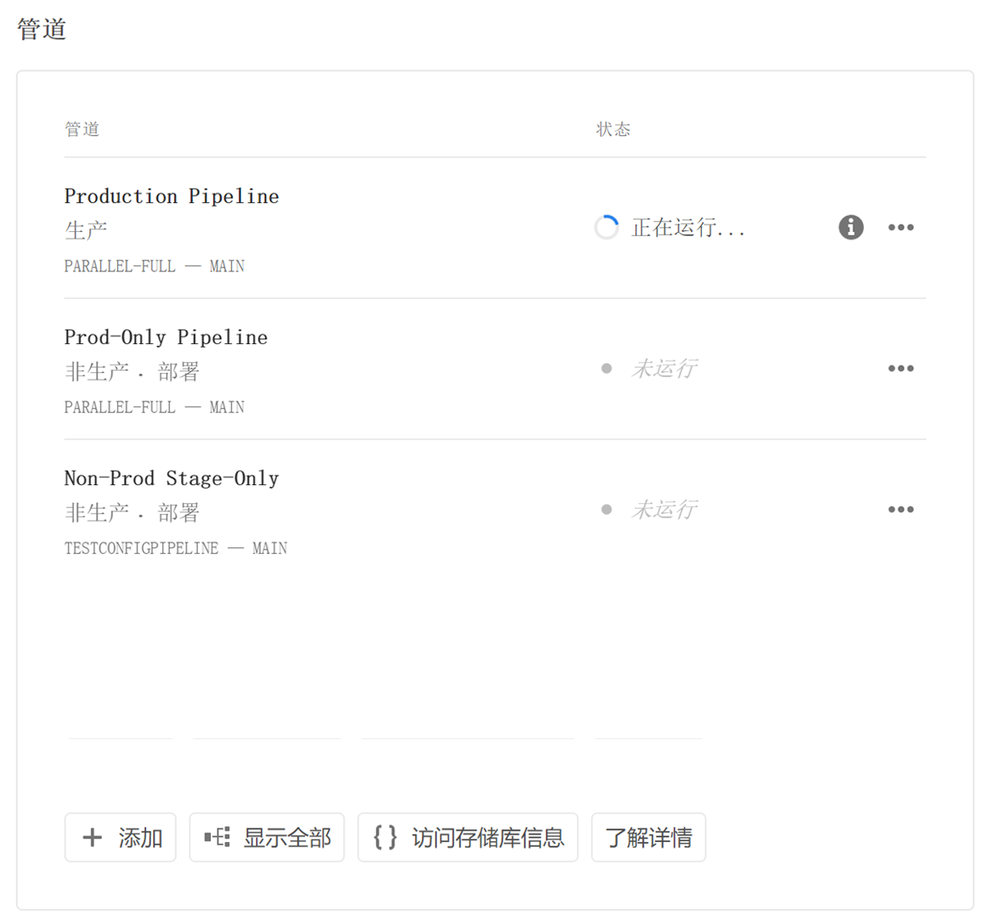
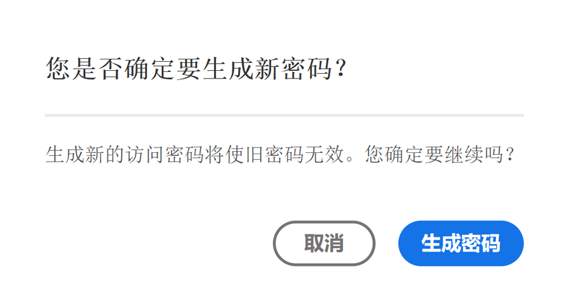
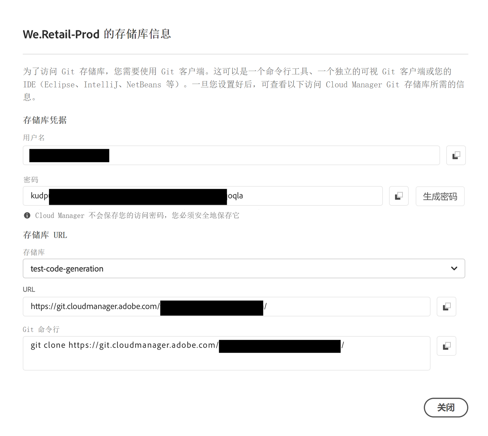

# 存储库访问信息 {#accessing-repos}

了解如何使用Cloud Manager中的自助Git帐户管理访问和管理Adobe管理的Git存储库。

## 从概述页面访问存储库信息 {#overview-page}

1. 在 [my.cloudmanager.adobe.com](https://my.cloudmanager.adobe.com/) 上登录到 Cloud Manager 并选择适当的组织和项目。

1. 从您的&#x200B;**项目概述**&#x200B;页面导航到&#x200B;**管道**&#x200B;信息卡。

   

1. 单击&#x200B;**访问存储库信息**。 在&#x200B;**存储库信息……**&#x200B;对话框中，可以查看以下内容：

   * Git用户名。
   * Git密码。
   * Cloud Manager Git存储库的URL。
   * 预建的Git命令，用于向Git存储库快速添加远程存储库和推送代码。

   

1. 要访问密码，必须生成一个新密码。单击 **`Generate password`**。

1. 在&#x200B;**是否确定……**&#x200B;对话框中，单击&#x200B;**生成密码**&#x200B;以确认密码生成。

   

1. 在&#x200B;**密码**&#x200B;字段中，生成密码。 单击复制图标以将其复制到剪贴板。

   * 生成密码将使上一个密码无效。
   * Cloud Manager不保存您的访问密码。 请确保安全地保存此密码。
   * 如果丢失密码，则必须生成新密码。

   

使用这些凭据，您可以克隆存储库的本地副本，在该本地存储库中进行更改，并在准备就绪后将任何代码更改提交回 Cloud Manager 中的远程代码存储库。

>[!NOTE]
>
>* **访问存储库信息**&#x200B;选项对具有&#x200B;**开发人员**&#x200B;角色或&#x200B;**部署管理员**&#x200B;角色的用户可见，或者对两者都可见。
>* **访问存储库信息**&#x200B;按钮仅显示 Adobe 管理的存储库的存储库访问信息。Cloud Manager 中没有关于[专用存储库](private-repositories.md)的访问信息。

## 从“存储库”窗口访问存储库信息 {#repositories-window}

**访问存储库信息**&#x200B;按钮也可在&#x200B;[**存储库**&#x200B;窗口](managing-repositories.md)的工具栏上使用。 它显示有关访问Adobe管理的存储库的相同信息。

## 撤销访问口令 {#revoke-password}

您可以随时撤销访问密码。[为此类请求创建支持工单](https://experienceleague.adobe.com/?support-solution=Experience+Manager&amp;support-tab=home#support)。

票证将优先处理，通常在一天内撤销。
