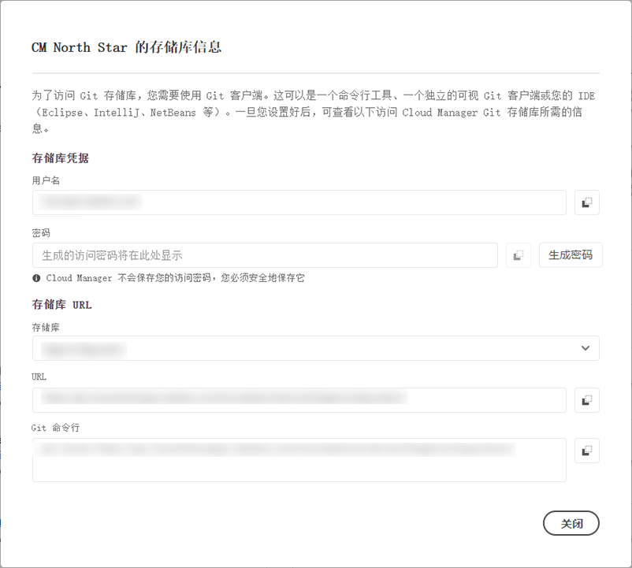

# 存储库访问信息 {#accessing-repos}

了解如何使用 Cloud Manager 的自助 Git 帐户管理访问和管理 Adobe 管理的 Git 存储库。

## 从概述页面访问存储库信息 {#overview-page}

Cloud Manager允许使用&#x200B;**管道**&#x200B;信息卡中的&#x200B;**访问存储库信息**，轻松检索Adobe管理的存储库的访问信息。

**存储库信息**&#x200B;对话框允许您查看Adobe管理的存储库的以下访问信息：

* Git 用户名。
* Git 密码。
* Cloud Manager Git 存储库的 URL。
* 预构建的 Git 命令，用于快速将远程添加到 Git 存储库并推送代码。

  

Cloud Manager 中没有关于[专用存储库](/help/managing-code/private-repositories.md)的访问信息。

**访问存储库信息**&#x200B;功能对具有&#x200B;**开发人员**&#x200B;或&#x200B;**部署管理员**&#x200B;角色的用户可见。

**要从概述页面访问存储库信息：**

1. 在 [my.cloudmanager.adobe.com](https://my.cloudmanager.adobe.com/) 上登录到 Cloud Manager 并选择适当的组织和项目。

1. 在&#x200B;**项目概述**&#x200B;页面的&#x200B;**管道**&#x200B;信息卡下，单击&#x200B;**访问存储库信息**。

   

1. 要访问密码，必须生成一个新密码。在&#x200B;**存储库信息**&#x200B;对话框中，选择&#x200B;**生成密码**。

1. 在确认对话框中，选择&#x200B;**生成密码**。

1. 在&#x200B;**密码**&#x200B;字段的右侧，单击以将密码复制到剪贴板。

   * 生成密码会使之前的密码失效。
   * Cloud Manager不保存密码。 您有责任安全地保存密码。
   * 由于Cloud Manager不会保存密码，因此如果丢失密码，则必须重新生成一个新密码。

   

使用这些凭据，您可以克隆存储库的本地副本，在该本地存储库中进行更改，并在准备就绪后将任何代码更改提交回 Cloud Manager 中的远程代码存储库。

## 从存储库窗口访问存储库信息 {#repositories-window}

**访问存储库信息**&#x200B;功能也可以从&#x200B;[**存储库**&#x200B;页面](/help/managing-code/managing-repositories.md)中获得。 该工具栏显示有关访问 Adobe 管理的存储库的相同信息。

## 撤销访问密码 {#revoke-password}

您可以随时撤消访问口令。

为此，请[为此请求](https://experienceleague.adobe.com/?support-solution=Experience+Manager&amp;support-tab=home#support)创建支持工单。 票证将优先处理，通常在一天内撤销。
