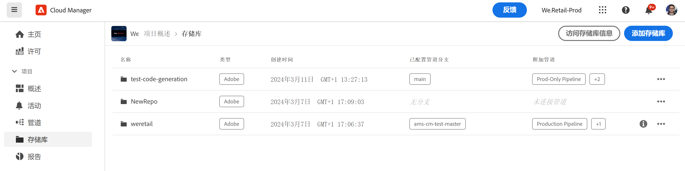

# 在 Cloud Manager 中添加 Adobe 存储库 {#adobe-repositories}

了解如何在 Cloud Manager 中创建 Adobe 管理的存储库。

## 添加 Adobe 管理的存储库 {#add-adobe-repository}

**存储库**&#x200B;窗口可让您轻松为项目添加其他 Adobe 管理的存储库。

1. 在 [my.cloudmanager.adobe.com](https://my.cloudmanager.adobe.com/) 上登录到 Cloud Manager 并选择适当的组织和项目。

1. 从&#x200B;**项目概述**&#x200B;页面中，选择&#x200B;**存储库**&#x200B;选项卡，然后切换到&#x200B;**存储库**&#x200B;页面。

1. 单击工具栏中的&#x200B;**添加存储库**。

   

1. 输入请求的名称和描述，然后单击&#x200B;**保存**。

   

当向导关闭时，您的新存储库将显示在&#x200B;**存储库**&#x200B;窗口的表中。您现在可以将 [CI/CD 管道](/help/overview/ci-cd-pipelines.md)与其关联，或在&#x200B;[**存储库**&#x200B;窗口内对其进行管理](managing-repositories.md)。

>[!TIP]
>
>您还可以将自己管理的 GitHub 存储库添加为[专用存储库](private-repositories.md)。
