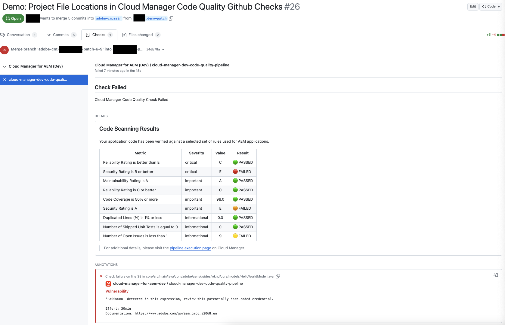
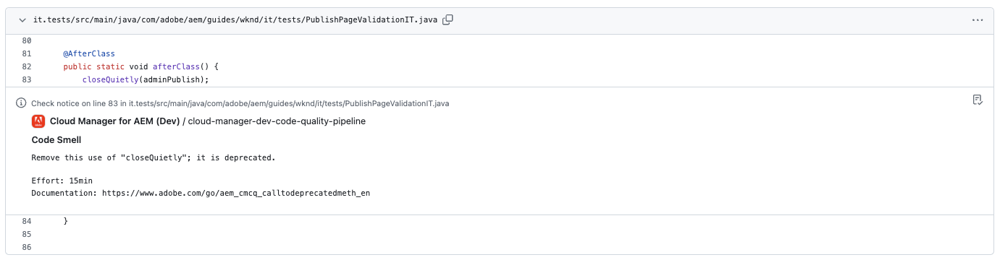

# GitHub 检查批注 {#github-annotations}

了解GitHub如何检查专用存储库的PR注释以向您提供反馈。

## 概述 {#overview}

如果您为Cloud Manager项目使用[专用存储库](private-repositories.md)，请为每个拉取请求自动签入GitHub。 这些检查带有注释，用于帮助您尽快识别代码的任何问题。

[代码质量](/help/using/code-quality-testing.md)检测到的问题 [SonarQube](/help/using/custom-code-quality-rules.md) 都清晰列出。

提供了包含问题的确切代码行，您可以选择它以查看相关代码。 这些注释适用于所有代码问题，而不仅仅是拉取请求中的代码问题。

所有带批注的行都汇总在&#x200B;**已更改文件** GitHub 拉取请求上的选项卡。 对于在拉取请求中未更改的文件，注释会显示在单独的部分。

## 代码质量管道 {#code-quality-pipelines}

[代码质量](/help/using/code-quality-testing.md)结果也显示在&#x200B;**检查**&#x200B;选项卡底部的管道中，Cloud Manager会自动触发该管道。 它也可以从拉取请求检查的&#x200B;**详细信息**&#x200B;访问。

您还可以以CSV文件形式查看问题。 您可以通过[在Cloud Manager](/help/using/managing-pipelines.md)中查看管道执行的详细信息来访问此信息。
