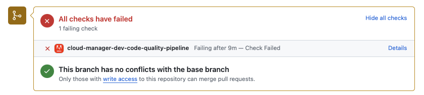

# GitHub检查注释 {#github-annotations}

了解GitHub如何检查专用存储库的PR注释，以向您提供有用的反馈。

## 概述 {#overview}

如果您为Cloud Manager项目使用[专用存储库](private-repositories.md)，则每个拉取请求都会自动运行GitHub签入。 这些检查带有有用信息的注释，可帮助您尽快了解代码的任何问题。

[代码质量](/help/using/code-quality-testing.md)检测到的问题 [SonarQube](/help/using/custom-code-quality-rules.md) 都清晰列出。

提供了存在问题的确切代码行，您可以单击该行显示相关代码。这些注释适用于所有代码问题，而不仅仅是拉取请求中更改的那些问题。

所有带批注的行都汇总在&#x200B;**已更改文件** GitHub 拉取请求上的选项卡。拉取请求中未更改文件的批注出现在其自己的部分中。

## 代码质量管道 {#code-quality-pipelines}

[代码质量](/help/using/code-quality-testing.md)结果也显示在管道中，Cloud Manager将在&#x200B;**检查**&#x200B;选项卡的底部自动触发该管道。 也可以从&#x200B;**详细信息**&#x200B;对拉取请求进行检查。

您还可以以 CSV 的形式将问题可视化。可通过[查看Cloud Manager](/help/using/managing-pipelines.md)中管道执行的详细信息来检索此方法。
