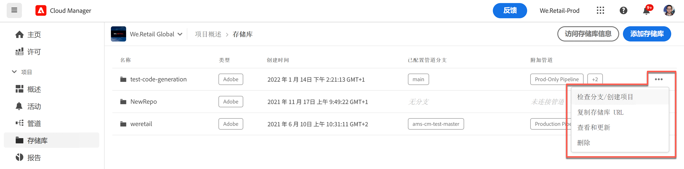

# Cloud Manager 存储库 {#cloud-manager-repos}

了解如何在 Cloud Manager 中创建、查看和编辑 Git 存储库。

## 概述 {#overview}

存储库用于使用 Git 存储和管理项目代码。您在 Cloud Manager 中创建的每个程序都有一个为其创建的 Adobe 管理的存储库。

您可以选择创建其他 Adobe 管理存储库，也可以添加您自己的专用存储库。您可在&#x200B;**存储库**&#x200B;窗口中查看与您项目相关的所有存储库。

在 Cloud Manager 中创建的存储库也可供您在添加或编辑管道时选择。 请参阅 [CI-CD 管道](/help/overview/ci-cd-pipelines.md)，以了解更多信息。

任何给定的管道都有一个主存储库或分支。 通过 [Git 子模块支持，](git-submodules.md)可以在构建时包括许多二级分支。

## 存储库窗口 {#repositories-window}

1. 在 [my.cloudmanager.adobe.com](https://my.cloudmanager.adobe.com/) 上登录到 Cloud Manager 并选择适当的组织和项目。

1. 从&#x200B;**项目概述**&#x200B;页面中，选择&#x200B;**存储库**&#x200B;选项卡，然后切换到&#x200B;**存储库**&#x200B;页面。

1. **存储库**&#x200B;窗口显示与您项目相关的所有存储库。

   

**存储库**&#x200B;窗口提供有关存储库的详细信息：

* 存储库类型
   * **Adobe** 表示 Adobe 管理的存储库
   * **GitHub** 表示您管理的专用 GitHub 存储库
* 创建时间
* 与存储库关联的管道

您可以在窗口中选择存储库，然后单击省略号按钮对选定的存储库执行操作。

* **[检查分支/创建醒目](#check-branches)**（仅适用于 Adobe 存储库）
* **[复制存储库 URL](#copy-url)**
* **[查看和更新](#view-update)**
* **[删除](#delete)**

## 添加存储库 {#adding-repositories}

点击或单击&#x200B;**存储库**&#x200B;窗口中的&#x200B;**添加存储库**&#x200B;按钮，启动&#x200B;**添加存储库**&#x200B;向导。

Cloud Manager 支持由 Adobe 管理的存储库（**Adobe 存储库**）以及您自行管理的存储库（**专用存储库**）。根据您选择添加的存储库类型，必填字段会有所不同。有关更多详细信息，请参阅以下文档：

* [在 Cloud Manager 中添加 Adobe 存储库](adobe-repositories.md)
* [在 Cloud Manager 中添加专用存储库](private-repositories.md)

>[!NOTE]
>
>* 用户必须具有&#x200B;**部署管理员**&#x200B;或&#x200B;**业务负责人**&#x200B;角色才能添加存储库。
>* 在任何给定公司或 IMS 组织的所有项目中，存储库的数量限制为 300 个。

## 访问存储库信息 {#repo-info}

在&#x200B;**存储库**&#x200B;窗口中查看您的存储库时，您可以通过点按或单击工具栏中的&#x200B;**访问存储库信息**&#x200B;按钮，查看有关如何以编程方式访问 Adobe 管理的存储库的详细信息。

**存储库信息**&#x200B;窗口将打开并显示详细信息。有关访问存储库信息的更多信息，请参阅文档[访问存储库信息](accessing-repositories.md)。

## 检查分支 {#check-branches}

**检查分支/创建项目** 操作根据存储库的状态执行两项功能。

* 如果存储库是新创建的，则该操作将基于 [AEM 项目原型创建示例项目。](https://experienceleague.adobe.com/zh-hans/docs/experience-manager-core-components/using/developing/archetype/overview)
* 如果存储库中已经创建了示例项目，它会检查存储库及其分支的状态，并报告示例项目是否已存在。

## 复制存储库 URL {#copy-url}

**复制存储库 URL**&#x200B;操作会将&#x200B;**存储库**&#x200B;窗口中选定存储库的 URL 复制到剪贴板以便在其他地方使用。

## 查看和更新 {#view-update}

**查看和更新**&#x200B;操作将打开&#x200B;**更新存储库**&#x200B;对话框。使用该对话框，您可以查看&#x200B;**名称**&#x200B;和&#x200B;**存储库 URL 预览**&#x200B;以及更新存储库的&#x200B;**描述**。

## 删除 {#delete}

**删除**&#x200B;操作会从您的项目中删除存储库。如果存储库与管道关联，则无法删除它。

请注意，在 Cloud Manager 中删除某个存储库时，将它标为已删除，用户无法再访问它，但在系统中保留它以供恢复。

如果您在删除同名存储库后尝试创建新存储库，您将收到错误消息 `An error has occurred while trying to create repository. Please contact your CSE or Adobe Support.`

如果显示此错误消息，请联系 Adobe 支持人员，以使其可协助重命名被删除的存储库或为新存储库选择其他名称。
