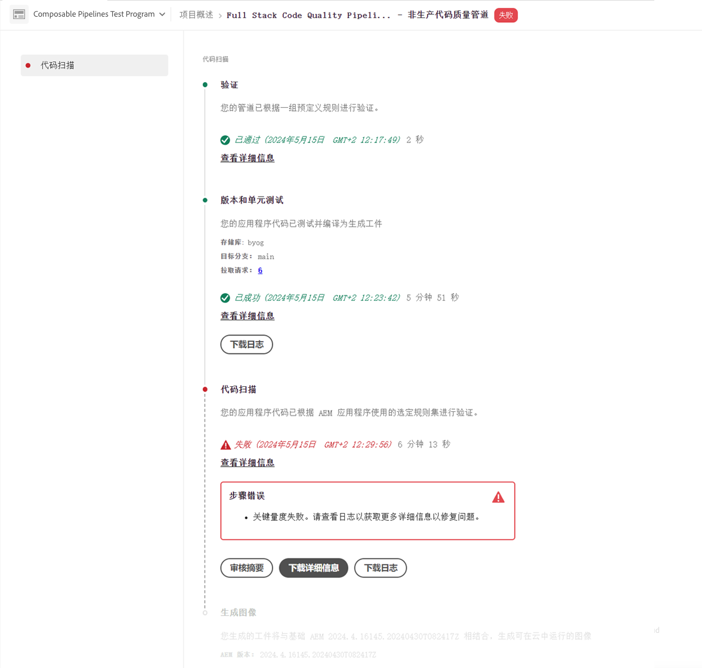

# 管理管道 {#managing-pipelines}

了解如何管理现有管道，包括运行、编辑和删除它们。

## 管道信息卡 {#pipeline-card}

Cloud Manager 中的&#x200B;**项目概述**&#x200B;页面上的&#x200B;**管道**&#x200B;信息卡概述了您的所有管道及其当前状态。

通过单击每个管道旁边的），您可以执行以下操作：

* [运行管道](#running-pipelines)。
* [编辑管道](#editing-pipelines)。
* [删除管道](#deleting-pipelines)。
* [查看详细信息](#view-details)。

管道列表的底部提供了以下常规选项。

* **添加** – 用于[添加新的生产管道](/help/using/production-pipelines.md)或[添加新的非生产管道](/help/using/non-production-pipelines.md)。
* **全部显示** – 将用户转至&#x200B;**管道**&#x200B;屏幕以在更详细的表中查看所有管道。
* **访问存储库信息** – 显示访问 Cloud Manager Git 存储库所需的信息。
* **了解详情** – 导航到 CI/CD 管道文档资源。

## 管道页面 {#pipelines}

**管道**&#x200B;页面显示所选项目的所有管道的完整列表。此列表很有用，因为它提供的信息比[管道信息卡](#pipeline-card)中的信息更全面。

1. 在 [my.cloudmanager.adobe.com](https://my.cloudmanager.adobe.com/) 上登录到 Cloud Manager 并选择适当的组织和项目。

1. 在&#x200B;**程序概述**&#x200B;页面中单击&#x200B;**管道**&#x200B;选项卡以切换到&#x200B;**管道**&#x200B;页面。

1. 在这里，您可以看到程序的所有管道的列表，并可以像在&#x200B;**管道信息卡**&#x200B;中一样启动和停止管道执行。

单击 `i` 图标可显示管道上次或当前执行的详细信息。

单击&#x200B;**查看详细信息**&#x200B;将转至[管道执行的详细信息](#view-details)。

## 活动页面 {#activity}

**活动**&#x200B;页面显示所选项目的所有管道执行的完整列表。

1. 在 [my.cloudmanager.adobe.com](https://my.cloudmanager.adobe.com/) 上登录到 Cloud Manager 并选择适当的组织和项目。

1. 在&#x200B;**项目概述**&#x200B;页面中单击&#x200B;**活动**&#x200B;选项卡以切换到&#x200B;**活动**&#x200B;页面。

1. 在这里，您可以看到项目的所有管道执行的列表，包括当前执行和历史执行。

单击 `i` 图标可显示有关执行所选管道运行的详细信息。

点击&#x200B;**查看详细信息**&#x200B;以查看[管道执行的详细信息](#view-details)。

## 运行管道 {#run-one-pipeline}

1. 在 [my.cloudmanager.adobe.com](https://my.cloudmanager.adobe.com/) 上登录到 Cloud Manager 并选择适当的组织和项目。
1. 从&#x200B;**项目概述**&#x200B;页面导航到&#x200B;**管道**&#x200B;信息卡。
1. 单击您运行的管道旁边的，然后单击&#x200B;**运行**。

   “状态”列指示管道何时开始运行。

   您可以通过再次单击和单击&#x200B;**[查看详细信息](#view-details)**&#x200B;来查看运行的详细信息。

   根据管道类型，您可以通过单击并单击&#x200B;**取消**&#x200B;来取消运行。

## 运行多个管道 {#run-multiple-pipelines}

借助Cloud Manager，您可以同时运行多个管道，从而提高Adobe Managed Services (AMS)客户的部署效率。 **运行选定项**&#x200B;功能允许您选择多个管道并触发它们同时运行。 它减少了不得不单独运行管道的手动工作量，并优化了构建和部署工作流。

**要运行多个管道：**

1. 在 [my.cloudmanager.adobe.com](https://my.cloudmanager.adobe.com/) 上登录到 Cloud Manager 并选择适当的组织和项目。
1. 从左侧菜单中，单击 **管道**。
1. 在&#x200B;**管道**页面上的表中，选中要运行的管道旁边的复选框。
如有必要，请单击 **筛选器**&#x200B;以按环境或部署的代码类型对管道进行排序，或同时单击两者。
1. 在页面的右上角附近，单击&#x200B;**运行选定项(x)**。
1. 在&#x200B;**运行所选管道(x)**&#x200B;对话框中，单击&#x200B;**运行(x)**。

   **运行**&#x200B;按钮反映了可以继续的管道数。 例如，您可能选择了四条管道，但一条管道已在运行。 或者，链接到选定管道的环境不再存在。 在这种情况下，系统相应地进行调整。 按钮将更新为“运行(3)”，表示三条管道可以继续运行。

1. 管道开始运行，其状态在&#x200B;**管道**&#x200B;列表中已更新。

## 编辑管道 {#editing-pipelines}

您无法编辑正在运行的管道。

**要编辑管道：**

1. 在 [my.cloudmanager.adobe.com](https://my.cloudmanager.adobe.com/) 上登录到 Cloud Manager 并选择适当的组织和项目。

1. 从&#x200B;**项目概述**&#x200B;页面，导航到&#x200B;**管道**&#x200B;信息卡。

1. 单击要编辑的管道旁边的，然后单击&#x200B;**编辑**。

1. 在&#x200B;**编辑生产管道**&#x200B;或&#x200B;**编辑非生产管道**&#x200B;对话框中，您可以编辑在创建管道期间输入的相同详细信息。

   有关管道可用的字段和配置选项的详细信息，请参阅[配置生产管道](/help/using/production-pipelines.md)和[配置非生产管道](/help/using/non-production-pipelines.md)。

1. 完成后，单击&#x200B;**更新**。

## 删除管道 {#deleting-pipelines}

您无法删除运行中的管道。

**要删除管道：**

1. 在 [my.cloudmanager.adobe.com](https://my.cloudmanager.adobe.com/) 上登录到 Cloud Manager 并选择适当的组织和项目。

1. 从&#x200B;**项目概述**&#x200B;页面，导航到&#x200B;**管道**&#x200B;信息卡。

1. 单击您运行的管道旁边的，然后单击&#x200B;**删除**。

## 查看管道详细信息 {#view-details}

您只能查看运行中或已运行至少一次的管道的详细信息。

**查看管道详细信息：**

1. 在 [my.cloudmanager.adobe.com](https://my.cloudmanager.adobe.com/) 上登录到 Cloud Manager 并选择适当的组织和项目。

1. 从&#x200B;**项目概述**&#x200B;页面，导航到&#x200B;**管道**&#x200B;信息卡。

1. 单击您运行的管道旁边的，然后单击&#x200B;**查看详细信息**。

1. 您将转到运行中的管道的详细信息页面。

在此页面中，您可以查看管道各个步骤的状态并检索构建日志以进行诊断。 有关更多信息，请参阅[代码部署](/help/using/code-deployment.md)文档。

管道执行中的所有步骤都将显示，而尚未开始的步骤将灰显。已完成的步骤将显示其持续时间。

管道步骤完成后会显示摘要。

单击&#x200B;**查看详细信息**&#x200B;链接以显示&#x200B;**持续时间**&#x200B;部分。该部分包括基于该项目的历史趋势的管道的平均持续时间。

如果您的管道包含&#x200B;**代码扫描**&#x200B;步骤，该步骤会导致问题，您可以单击&#x200B;**下载详细信息**&#x200B;以查看未通过的[代码质量测试](/help/using/code-quality-testing.md)的列表。

CSV 文件中有一个&#x200B;**项目文件位置**&#x200B;列，用于指示有问题代码的位置。此列是项目相对路径，而&#x200B;**文件位置**&#x200B;列是由 Maven 生成的。

